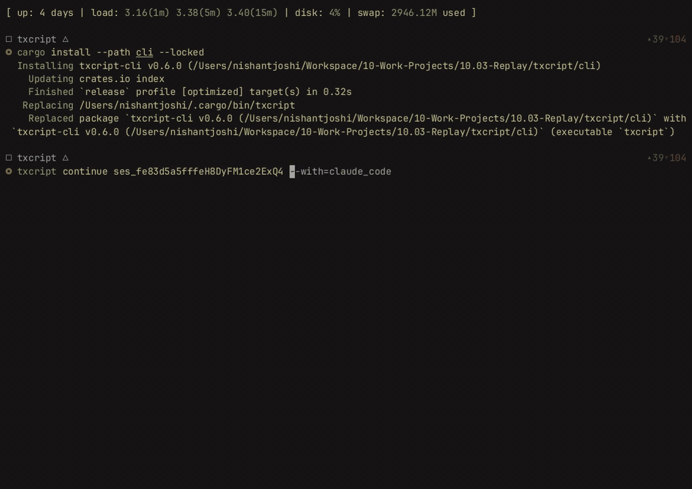

<p align="center">
  <picture>
    <source media="(prefers-color-scheme: dark)" srcset="docs/assets/wordmark-dark.svg?v=3">
    
  </picture>
</p>

<p align="center">Find what your coding agents already worked out, and carry it into the next agent.</p>

<p align="center">
  English | <a href="docs/translations/README.ja.md">日本語</a> | <a href="docs/translations/README.zh-CN.md">简体中文</a> | <a href="docs/translations/README.zh-TW.md">繁體中文</a> | <a href="docs/translations/README.ko.md">한국어</a> | <a href="docs/translations/README.de.md">Deutsch</a> | <a href="docs/translations/README.es.md">Español</a> | <a href="docs/translations/README.fr.md">Français</a> | <a href="docs/translations/README.it.md">Italiano</a> | <a href="docs/translations/README.pt-BR.md">Português (Brasil)</a> | <a href="docs/translations/README.ru.md">Русский</a> | <a href="docs/translations/README.mr.md">मराठी</a> | <a href="docs/translations/README.ta.md">தமிழ்</a>
</p>

<p align="center">
  <a href="https://crates.io/crates/contextleleo"></a>
  <a href="https://www.npmjs.com/package/contextleleo"></a>
  <a href="https://docs.rs/contextleleo"></a>
  <a href="https://github.com/Adityakk9031/contextleleo/actions/workflows/ci.yml"></a>
  <a href="LICENSE"></a>
</p>

Your coding agents keep their own session history, locked inside each tool. contextleleo reads those real stores across Claude Code, Codex, Cursor, Antigravity, Freebuff and more, so you can:

- **Find the old context.** Ask a question and get the relevant history from *any* agent's past sessions, each piece traced back to `session#message`. The [Jev API](https://docs.typesafe.ai) decides what matters; contextleleo searches.
- **Hand off a trimmed session.** Continue a conversation in another agent without sending everything. Jev scores each message for the next task, large tool output is folded into stand-ins that link back to the original, and the result is written into the target agent's own store as a native session.
- **Keep it safe.** Stored sessions are never modified, and secret values are shown as `NAME=********` on screen.

It is a CLI, a Rust library, and a WebAssembly package for converting and searching sessions.

> **Two features are optional and need a Jev API key: retrieval and smart trimming.** Everything else — listing, viewing, searching, exporting, and moving a session between agents — works with no account. After installing, run `contextleleo setup` to turn the two Jev features on (it asks first, hides the key as you type, and stores it readable by you only), or skip it and use contextleleo as a plain session converter. Get a key at [docs.typesafe.ai](https://docs.typesafe.ai/introduction/quickstart). See [What you need](#what-you-need).

[Try the CLI](#try-the-cli) · [Use the library](#use-the-library) · [Supported agents](#supported-agents) · [Documentation](#documentation)

<p align="center">
  
</p>

## What you need

| You want to | You need |
|---|---|
| `list`, `view`, `query`, `export`, `crop`, `mcp`, plain `continue --with <agent>` | Just the CLI. No key, no network. |
| `context "<question>"`, `continue --retrieve`, `continue --jev --task` | The CLI **and a Jev API key**: run `contextleleo setup`, or `export JEV_API_KEY=...` (`TYPESAFE_API_KEY` also works; the environment wins over the stored key). Without one these commands write nothing; at a terminal they offer to run `setup`, in a script they exit 1 with a configuration error. |
| `continue --jev --budget N` (rule-based trimming, no `--task`) | Just the CLI. No key. |
| The JavaScript package (`npm install contextleleo`) | Nothing. It converts and searches session text in memory; retrieval and Jev are not part of the WebAssembly build. |

**Privacy.** The Jev commands send short excerpts (up to 800 characters per candidate, up to 64
candidates per call) to the Jev API, with credential-shaped strings removed first. Full sessions are
never uploaded. Run them only on history you are comfortable sending to that service. The key is read
from your environment or the file `contextleleo setup` writes (`~/.config/contextleleo/config`,
owner-only), and is never logged. `contextleleo setup --status` shows where it comes from without
printing it; `setup --remove` deletes it.

## Try the CLI

Clone and build it (Rust 1.96 or newer; no npm needed):

```sh
git clone https://github.com/Adityakk9031/contextleleo
cd contextleleo
cargo build --release --locked -p contextleleo-cli
./target/release/contextleleo --help        # or: cargo install --path cli --locked
```

Or install straight from GitHub without cloning:

```sh
cargo install --git https://github.com/Adityakk9031/contextleleo contextleleo-cli --locked
```

Prebuilt binaries for macOS, Linux, and Windows will appear on [Releases](https://github.com/Adityakk9031/contextleleo/releases) once the first version is published. Then, only if you want retrieval and smart trimming, run `contextleleo setup` and paste your Jev key (see [What you need](#what-you-need)).

Find a Claude Code session and continue it in Codex:

```sh
contextleleo list --from claude_code
contextleleo continue <session-id> --with codex
```

Use an ID from the list; an unambiguous prefix works too. contextleleo writes a new native session and launches Codex in the recorded working directory. The source session is kept. Have the target agent installed and signed in before continuing.

Other ways to work with your sessions:

```sh
contextleleo query "relay bug"                # search local session history
contextleleo context "relay bug"              # retrieve the relevant history, sized to a budget
contextleleo view <session-id>                # read a conversation in the terminal (secret values shown as ********)
contextleleo crop <session-id>                # edit or trim history into a new copy
contextleleo export <session-id> --out run.json
contextleleo continue <session-id> --jev --task "what the next agent will do"
                                             # Jev scores each message for that task
```

`contextleleo context "task"` gathers candidate chunks from every stored session with a cheap
local search (keywords, file paths, symbols, errors, tool names, recency), then asks the **Jev
API** — TypeSafe AI's System One decision model — which of them actually matter for the task:
contextleleo searches, Jev decides. Jev returns a probability per candidate; those at or above
0.5 are printed with their `session#message` source. Configure it with your key:

```bash
export JEV_API_KEY=...   # your TypeSafe (Jev) API key; TYPESAFE_API_KEY also works
# Optional overrides — these are the defaults:
export JEV_API_URL=...   # https://api.typesafe.ai/v1/systemone
export JEV_MODEL=...     # jev-latest
```

Without a key, `context` and `continue --retrieve` stop with a configuration error pointing at
`contextleleo setup`; every other command (`list`, `view`, `query`, `export`, plain `continue`) needs no key.
Only bounded excerpts of the candidates leave your machine, never the full history. Add `--budget` to
run the assembled context through Jev's optimizer, which keeps, compresses, or drops each chunk
to fit. Retrieval is read-only: no stored session is modified, and every kept chunk stays
traceable to its original. The same lookup can lead a handoff — `contextleleo continue
<session-id> --with codex --jev --retrieve "task"` prepends the retrieved context before Jev
optimizes the whole to `--budget`.

Add `--task "what the next agent will do"` to `continue --jev` and Jev scores every message of the
session being handed off for relevance to that task. Jev's score decides keep / compress / drop for each message you did not write: 0.7 or more is kept in full (even big tool output), below 0.3 is dropped, anything between becomes a stand-in with a `view` link to the original. `--budget` is optional and still trims further, least relevant first. Your messages and error results are never lowered, whatever Jev says, and
without `--task` the default rules decide exactly as before.

**See the whole pipeline run:** `./demo/run.sh` seeds an earlier incident and tonight's repeat of it into Antigravity's store format, retrieves the earlier answer with Jev ranking the candidates (never from the session being continued), trims the handoff, and writes it into Freebuff's own store as a new thread. It is hermetic by default (needs a Jev key, no agent installed), with a [captured transcript](demo/transcript.md) and a [shot-by-shot video script](demo/VIDEO_SCRIPT.md).

Move `run.json` to another machine and continue it with `contextleleo continue ./run.json --with claude_code`. Bring the project files separately.

Run `contextleleo mcp` to let an MCP client list, search, and read past sessions. Its tools are read-only. See the [CLI reference](docs/usage.md#cli) for filters, message ranges, and shell integration.

## Use the library

### Rust

```sh
cargo add contextleleo
```

Convert a Claude Code transcript into Codex's native format:

```rust
use contextleleo::harness::{claude_code::ClaudeCode, codex::Codex};
use contextleleo::{TextCodec, convert};

fn main() -> Result<(), Box<dyn std::error::Error>> {
    let input = std::fs::read_to_string("session.jsonl")?;
    let source = ClaudeCode::from_text(&input)?;
    let target = convert::<ClaudeCode, Codex>(&source)?;
    std::fs::write("rollout.jsonl", Codex::to_text(&target)?)?;
    Ok(())
}
```

Use `Store` implementations to discover, load, and save sessions in an agent's own storage. Convert to `Transcript<Common>` to search, crop, or render conversations through the same API across agents. See the [Rust API](https://docs.rs/contextleleo) and [examples](docs/usage.md#rust-crate).

### JavaScript

```sh
npm install contextleleo
```

```js
import { convert } from "contextleleo";
import { readFileSync, writeFileSync } from "node:fs";

const input = readFileSync("session.jsonl", "utf8");
const output = convert(input, "claude_code", "codex");
writeFileSync("rollout.jsonl", output);
```

The package includes prebuilt WebAssembly for Node and Bun. It converts and searches session text in memory; your application handles files and storage. It does not include the CLI, local session discovery, or the Jev-powered retrieval and trimming, so it needs no API key. For those, install the CLI. See the [JavaScript reference](docs/usage.md#npm-package).

## Supported agents

Each name links to its format documentation. Use the ID with `--from` and `--with`.

| Agent | ID | Read from | Continue into |
|---|---|:---:|:---:|
| [Claude Code](docs/formats/claude-code.md) | `claude_code` | Yes | Yes |
| [Codex](docs/formats/codex.md) | `codex` | Yes | Yes |
| [OpenCode](docs/formats/opencode.md) | `opencode` | Yes | Yes |
| [Cursor CLI](docs/formats/cursor.md) | `cursor` | Yes | Yes |
| [Cursor desktop](docs/formats/cursor-desktop.md) | `cursor_desktop` | Yes | Yes |
| [pi](docs/formats/pi.md) | `pi` | Yes | Yes |
| [Campfire](docs/formats/campfire.md) | `campfire` | Yes | Yes |
| [Cowork](docs/formats/cowork.md) | `cowork` | Yes | Yes |
| [Grok CLI](docs/formats/grok.md) | `grok` | Yes | Yes |
| [Grok Bot](docs/formats/grok-bot.md) | `grok_bot` | Yes | Via local gateway |
| [fx](docs/formats/fx.md) | `fx` | Yes | Yes |
| [Antigravity](docs/formats/antigravity.md) | `antigravity` | Yes | Yes |
| [Freebuff](docs/formats/freebuff.md) | `freebuff` | Yes | Yes (opens the app) |
| [Hermes Agent](docs/formats/hermes.md) | `hermes` | Yes | No |
| [Amp](docs/formats/amp.md) | `amp` | Yes | No |
| [Cloud Cowork](docs/formats/cowork-remote.md) | `cowork_remote` | Live account | No |
| [Claude Chat](docs/formats/claude-chat.md) | `claude_chat` | Live account | No |
| [ChatGPT](docs/formats/chatgpt.md) | `chatgpt` | Live account | No |

Local discovery skips the live accounts. Select `--from claude_chat`, `--from cowork_remote`, or `--from chatgpt` explicitly to read them. These sources use private web APIs and reuse an existing app login; requirements and limitations are in their linked docs.

### Bring another agent

An agent without a native adapter can emit [Simple](docs/formats/simple.md), contextleleo's interchange JSON. Save a document like this as `run.json`:

```json
{
  "messages": [
    { "role": "user", "content": "Find why the tests fail." },
    { "role": "assistant", "content": "The test clock is using local time." }
  ]
}
```

```sh
contextleleo continue ./run.json --with claude_code
```

Simple also represents reasoning, tool calls, results, images, and metadata. It is the format `contextleleo export` writes.

## What carries over

The common model represents messages, reasoning, tool calls and results, images, metadata, and token usage. What survives conversion depends on what the source records and the destination can represent. Agent-specific records and unsupported fields can be lost.

Conversion carries conversation history. The destination supplies its own system instructions and tools, and project files must be available separately. Native load/save and conversion have different preservation guarantees; see each [format's caveats](docs/formats/README.md).

## Documentation

- [CLI reference](docs/usage.md#cli): commands, search, cropping, MCP, and shell integration.
- [Rust API](https://docs.rs/contextleleo) and [JavaScript reference](docs/usage.md#npm-package).
- [Transcript formats](docs/formats/README.md): storage layouts, mappings, and limitations, with sources and reverse-engineering notes.
- [Development](docs/usage.md#development) and [test guide](tests/README.md).
- [Contributing](CONTRIBUTING.md) · [Report a security vulnerability](SECURITY.md).
- [Changelog](CHANGELOG.md) · [Report an issue](https://github.com/Adityakk9031/contextleleo/issues).

## License

[Apache-2.0](LICENSE)
